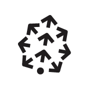
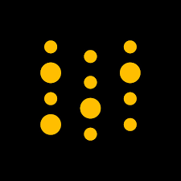
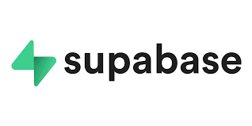

<h1 align="center">
  
</h1>
   
###    About Me:

  Hi, I'm Kaleb Nim, AI Engineer from Singapore
   
   
  👨‍🎓 I'm currently working full-time @A*STAR - Agency for Science, Technology and Research(ARTC) as an AI Engineer
  
   
  💻 I love LLMs, NLP, Data Science and learning anything about them 😊
   
  📚 I’m currently focusing on Generative AI, LLM
   
  📫 How to reach me 👇

  
<!--    -->
 <!--   -->
   

<h2 align="center">🔥 Languages & Frameworks & Tools & Abilities 🔥</h2> 

<!--   <code></code> -->
  </code>
  
<!--   <code></code> -->
  
  
  
  
  
  
  
  

  
  
  
  
  
  
  

<!--   <code></code> -->

<h2 align="center">⚡ Stats ⚡</h2>
 

<!--   ADD Most Popular Repos Next time ba -->

